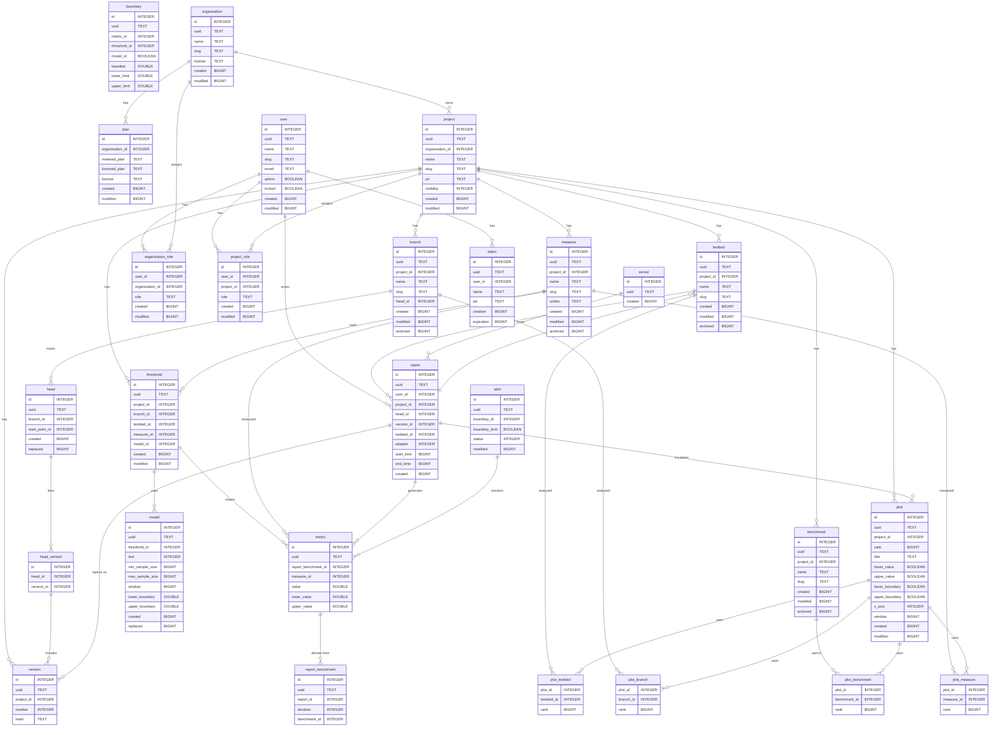

## Getting Started

In order to get started with the project, you will need to have the following
prerequisites installed on your machine.

### Prerequisites

- [Docker](https://docs.docker.com/get-docker/)
- [Rust](https://www.rust-lang.org/tools/install)
- [Node.js](https://nodejs.org/en/)
- [typeshare](https://crates.io/crates/typeshare)
- [wasm-pack](https://crates.io/crates/wasm-pack)

### Installation

1. Fork the repository (optional)
2. Clone the repository
   ```shell
   git clone git@github.com:bencherdev/bencher.git
    ```
3. Checkout the `devel` branch
   ```shell
   git checkout devel
   ```
4. Build the project
    ```shell
    cargo build
    ```
5. Run the API service
   ```shell
   cd services/api
   cargo run
   ```
6. Run the Console
    ```shell
    cd services/console
    npm run dev
    ```
7. Configure the CLI environment
   ```shell
   cd ./services/cli 
   . ./env.sh
   ```

### Accessing the Console

Once the application is running, you can access it by visiting
[http://localhost:3000](http://localhost:3000) in your browser.

1. Sign up for an account by entering your name and email address.
2. Click on the "Confirm Email" link that is provided in the API logs.

### Accessing the API

The API is accessible at [http://localhost:61016](http://localhost:61016).

### Seeding the Database

To seed the database with sample data, run the following command:

```shell
cargo test-api seed
```

### Accessing the Database

The data is stored in a SQLite database that is created in the `services/api/data` directory
when the application is started.  The database can be accessed using the `sqlite3` command:

```shell
sqlite3 services/api/data/bencher.db
```

#### Entity Relationship Diagram



### Testing with Docker

To test the application using Docker, follow these steps:

1. Build and run the project
   ```shell
   docker/run.sh
   ```
   or run directly with docker compose using the following command:

   **X64**
   ```shell
   ARCH=amd64 docker compose up --file docker/docker-compose.yml --build
   ```
   **ARM64**
   ```shell
   ARCH=arm64 docker compose up --file docker/docker-compose.yml --build
   ```
2. Open the console in your browser [http://localhost:3000](http://localhost:3000).
3. Sign up for an account by entering your name and email address.
4. Click on the "Confirm Email" link that is provided in the docker compose logs.
